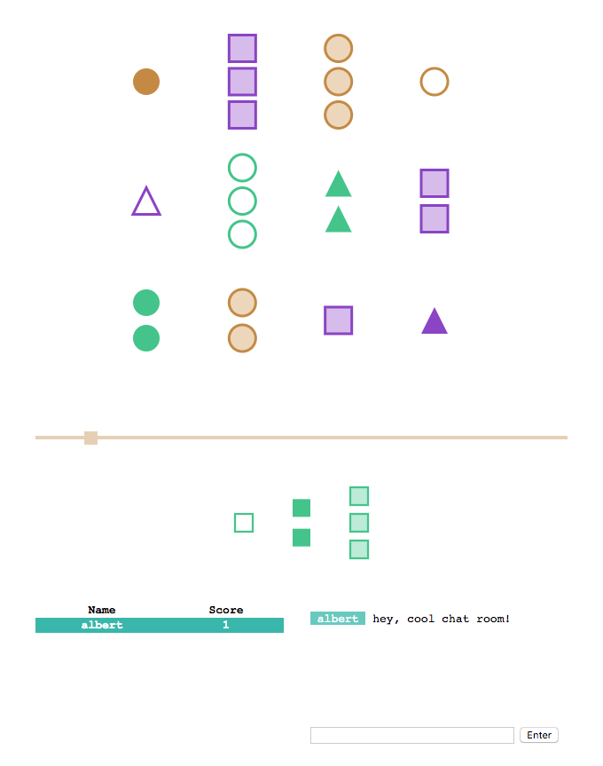

# slanet

Barebones [LAN](https://en.wikipedia.org/wiki/Local_area_network) implementation of [Set](https://en.wikipedia.org/wiki/Set_(card_game)) for the browser.



Needed things
---
 * [Nix](https://nixos.org/nix/)

Server start
---
```
$ nix-shell
[nix-shell:path/to/slanet]$ ./main
```
